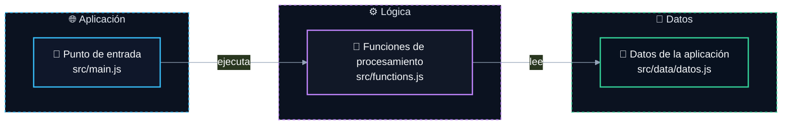

# 📝 batoibooks

    


Batoibooks es un proyecto que procesa y filtra datos de libros relacionados con módulos educativos y usuarios. Utiliza funciones para obtener, filtrar y manipular información de libros, mostrando resultados en la consola. Incluye pruebas unitarias con Vitest y se ejecuta mediante Vite para desarrollo.

> ⚡ Procesamiento eficiente de datos educativos en entorno Interfaz

## ⚙️ Tecnologías

- 🧪 **Pruebas**: Vitest
- 🐳 **Infraestructura**: Docker, GitHub Actions
- 🔧 **Herramientas**: Vite

## ✨ Características

- 🚀 Desarrollo rápido con Vite y servidor en vivo
- 🧪 Pruebas unitarias automatizadas con Vitest
- 🐳 Contenedorizado con Docker para entornos consistentes
- 📂 Estructura clara de datos y funciones modulares
- 🔧 Filtrado y manipulación de libros por usuario y módulo
- ⚙️ Flujo de trabajo CI/CD automatizado con GitHub Actions

<!-- readme-gen:architecture:start -->
## 🏗️ Arquitectura



| Componente | Tecnología | Detalle |
| --- | --- | --- |
| Aplicación | Vite | Punto de entrada principal en `src/main.js` |
| Lógica | JavaScript | Funciones principales en `src/functions.js` |
| Datos | JavaScript | Datos almacenados en `src/data/datos.js` |
| Pruebas | Vitest | Tests automatizados del proyecto |

<!-- readme-gen:architecture:end -->

## 🗂️ Estructura del proyecto

```txt
batoibooks/
├── .github/               # GitHub metadata
│   └── workflows/         # CI/CD workflows
│       └── ci.yml         # CI workflow
├── notes/                 # Project documentation
│   ├── 1-introduccion.md  # Introduction document
│   └── 2-arrays.md        # Arrays documentation
├── public/                # Static assets
│   ├── favicon.svg        # Website favicon
│   ├── icons.svg          # SVG icons
│   └── logoBatoi.png      # Project logo
├── src/                   # Source code
│   ├── data/              # Application data
│   │   └── datos.js       # Data definitions
│   ├── style/             # Stylesheets
│   │   └── styles.css     # Main stylesheet
│   ├── functions.js       # Utility functions
│   └── main.js            # Main application file
├── test/                  # Pruebas files
│   ├── functions.test.js  # Functions Pruebas
│   └── main.test.js       # Main module Pruebas
├── .gitignore             # Git ignore rules
├── docker-compose.yml     # Docker configuration
├── index.html             # Main HTML file
├── package-lock.json      # Dependency lock file
└── package.json           # Project metadata
```

## 📦 Instalación

```bash
npm install
```

## 🧪 Pruebas

Este proyecto incluye pruebas con Vitest.

```bash
npm run test
```

## 🐳 Docker

Este proyecto incluye configuración de Docker.

## 👤 Autor

Hecho por **David Torró**

## 📄 Licencia

Sin licencia especificada.

---

Generado con [readme-gen](https://readme-gen.davidtorro.com).
