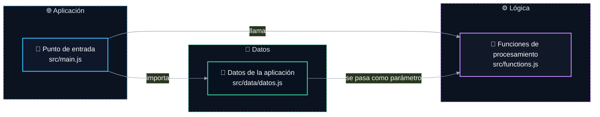

# 📝 Batoibooks

    


Batoibooks es un proyecto que procesa y filtra datos de libros relacionados con módulos educativos y usuarios. Utiliza funciones para obtener, filtrar y manipular información de libros, mostrando resultados en la consola. Incluye pruebas unitarias con Vitest y se ejecuta mediante Vite para desarrollo.

## ⚙️ Tecnologías

- 🧪 **Pruebas**: Vitest
- 🐳 **Infraestructura**: Docker, GitHub Actions
- 🔧 **Herramientas**: Vite

## ✨ Características

- 🚀 Desarrollo rápido con Vite y servidor en vivo
- 🧪 Pruebas unitarias automatizadas con Vitest
- 🐳 Contenedorizado con Docker para entornos consistentes
- 📂 Estructura clara de datos y funciones modulares
- 🔧 Filtrado y manipulación de libros por usuario y módulo
- ⚙️ Flujo de trabajo CI/CD automatizado con GitHub Actions

<!-- readme-gen:architecture:start -->

## 🏗️ Arquitectura



| Componente | Tecnología | Detalle                                     |
| ---------- | ---------- | ------------------------------------------- |
| Aplicación | Vite       | Punto de entrada principal en `src/main.js` |
| Lógica     | JavaScript | Funciones principales en `src/functions.js` |
| Datos      | JavaScript | Datos almacenados en `src/data/datos.js`    |
| Pruebas    | Vitest     | Tests automatizados del proyecto            |

<!-- readme-gen:architecture:end -->

## 🗂️ Estructura del proyecto

```txt
batoibooks/
├── .github/                 # Configuración de GitHub
│   └── workflows/           # Flujos de CI/CD
│       └── ci.yml           # Flujo de CI
├── assets/                  # Recursos del proyecto
│   └── banner.svg           # Banner del proyecto
├── notes/                   # Enunciado del proyecto
│   ├── 1-introduccion.md
│   └── 2-arrays.md
├── public/                  # Recursos públicos
│   ├── favicon.svg
│   ├── icons.svg
│   └── logoBatoi.png
├── src/                     # Código fuente
│   ├── data/                # Datos
│   │   └── datos.js
│   ├── style/               # Estilos
│   │   └── styles.css
│   ├── functions.js         # Funciones del proyecto
│   └── main.js              # Punto de entrada principal
├── test/                    # Pruebas
│   ├── functions.test.js    # Pruebas de funciones
│   ├── contrato.test.js     # Pruebas de contrato del profesor
│   └── main.test.js         # Prueba inicial del profesor
├── .gitignore               # Archivos ignorados por Git
├── docker-compose.yml       # Configuración de Docker Compose
├── index.html               # HTML principal
├── package-lock.json        # Versiones bloqueadas de dependencias
├── package.json             # Configuración del proyecto
└── README.md                # Documentación del proyecto
```

## 📦 Instalación

Necesitaremos tener Docker con Docker Compose instalado en nuestro sistema.

### Clonar el repositorio

```bash
git clone https://github.com/DavidTorro/BatoiBooks.git
cd BatoiBooks
```

### Arrancar el proyecto

```bash
docker compose up -d
```

Al arrancar el contenedor, se instalarán las dependencias y se ejecutará el proyecto. Puedes acceder a la aplicación en tu navegador en `http://localhost:5173`.

### Parar el proyecto

```bash
docker compose down
```

## 🧪 Pruebas

Este proyecto incluye pruebas con Vitest.

### Ejecutar todos los tests

```bash
docker compose exec batoibooks npm test -- --run
```

### Ejecutar un test específico para ver si estan las funciones(archivo del profesor)

```bash
docker compose exec batoibooks npm run test:contrato -- --run
```

### Ejecutar un test específico de las funciones (mio propio)

```bash
docker compose exec batoibooks npm run test:functions -- --run
```

## 👤 Autor

Hecho por **David Torró**

---

Generado con [readme-gen](https://readme-gen.davidtorro.com).
