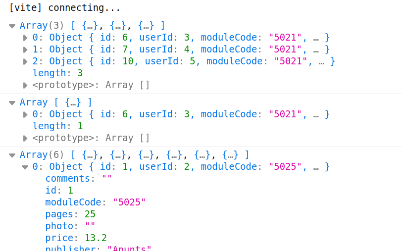

# 3. Clases

Continuando con nuestra aplicación para vender libros de texto y apuntes vamos a construir las clases que usaremos en la aplicación. Para esta práctica crearemos en nuestro repositorio una nueva rama llamada **_3-clases_**.

Dentro de **_`/src`_** crearemos una carpeta llamada **_`model`_** donde crearemos las clases. Aunque deberíamos hacerlas ya todas, al menos vamos a hacer aquellas con las que estamos trabajando: _book, books, user, users, module_ y _modules_.

Las clases de objeto (_Book_, _User_ y _Module_) tendrán

- un **constructor**: recibe los datos del objeto a crear. El de _User_ recibe _id, nick, email_ y _password_. El de _Module_ _code, cliteral, vliteral_ y _courseId_. El de _Book_, al ser muchos campos, recibirá un objeto con TODOS los campos aunque _photo, comments_ y _soldDate_ son opcionales y si no los recibe les asigna una cadena vacía
- un método **_toString_** para mostrar el objeto

Las clases de array (_Books, Users_ y _Modules_) tendrán:

- **constructor**: inicializa una propiedad llamada _data_ a un array vacío
- **_populate_**: recibe un array con los datos iniciales y los carga en el array _data_. No devuelve nada
- **_addXXXX_** _(addBook y addUser)_: recibe un objeto con los datos del nuevo elemento (sin _id_) y lo añade al array _data_. Devuelve el nuevo elemento añadido
- **_removeXXXX_** _(removeBook, removeUser)_: recibe una _id_ y lo elimina del array. No devuelve nada. Si no existe lanzará una excepción
- **_changeXXXX_** _(changeBook, changeUser)_: rrecibe un objeto con los datos del nuevo elemento y sustituye el del array por el recibido. Devuelve el elemento modificado y si no existe en el array lanzará una excepción
- **_toString_** muestra los elementos del array (llama al **_toString_** de cada elemento)
- el resto de métodos hechos en el ejercicio anterior (**_booksFromUser_**, **_getUserByNick_**, etc) que ya no necesitaran recibir el array con los datos.

Recordad que hay que exportar cada clase para poderla usar en otros ficheros, por ejemplo, en **_book.class.js_**:

```
export default class Book {
  ...
}
```

Y donde tengamos que usarla la importaremos, por ejemplo en **_books.class.js_**:

```
import Book from './book.class'
```

En el **_main.js_** lo que haremos es:

- importamos la variable _data_ del fichero **_[datos.js](https://aules.edu.gva.es/fp/mod/resource/view.php?id=10486193)_**
- creamos una nueva instancia de _Modules, Users_ y _Books_ y las llenamos con los datos de _data_ (**_populate_**)
- y a continuación:
  - mostramos por consola todos los libros del módulo 5021
  - mostramos los que están nuevos (estado "new")
  - incrementamos un 10% el precio de los libros y los mostramos por consola

El resultado debe ser similar a:



**MUY IMPORTANTE**: pasa los tests para asegurarte aprobar este ejercicio.
